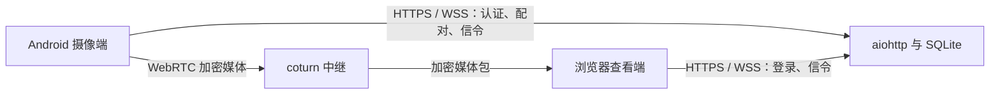

# 系统架构

HomeCam Lite 把控制链路和媒体链路分开。Python 服务认证客户端，只转发受限的 WebRTC 信令消息。摄像端与查看端使用临时 TURN 凭据建立 WebRTC peer connection；生产配置强制两端使用 TURN 中继。TURN 转发加密媒体包，不解码音视频。

## 组件

| 组件 | 职责 | 不负责 |
|---|---|---|
| Android 摄像端 | 用户启动的摄像头前台服务、设备令牌、相机/麦克风权限、WebRTC offer 和媒体轨道 | 开机后秘密启动摄像头；无查看者时持续上传媒体 |
| 浏览器查看端 | 管理员登录、选择设备、配对、WebRTC answer、本机快照下载 | 在服务器保存录像 |
| aiohttp 服务 | HTTPS API、Cookie 会话、配对码、设备令牌、WebSocket 认证与范围受限的信令转发、SQLite 元数据、短时 TURN 凭据 | 转发或录像音视频 |
| coturn | 认证 TURN allocation 并转发 WebRTC 包 | 解密或录像媒体 |
| Caddy / systemd | 可信 HTTPS 终止和隔离服务生命周期 | 替换或重配主机上的无关服务 |

## 连接与信任边界

1. 管理员经 HTTPS 登录、创建一次性配对码、撤销设备并请求 TURN 凭据。Android 应用兑换配对码后，在本机保存设备令牌。
2. 摄像端和查看端通过 WSS 连接 `/ws`。服务端验证每个 WebSocket，并从已认证的会话或设备令牌推导 peer 身份；只允许向现有 watch membership 的另一端转发信令。
3. 两端获取新的 TURN 临时凭据。ICE candidate 和 offer/answer SDP 经信令服务传递；生产 WebRTC 媒体只使用 TURN 中继。
4. WebRTC 的 DTLS-SRTP 在摄像端与查看端之间保护媒体。TURN 转发这些数据包。应用服务持久保存账号、设备和会话元数据，并仅在连接期间处理信令，不保存可解码媒体流。

TLS 保护客户端到服务端的连接以及 TURN 凭据下发。TURN 服务仍会看到网络地址、allocation 元数据、流量大小和时间信息；WebRTC 加密不隐藏这些传输元数据。

## 容量模型

默认媒体目标约为 450 kbps 视频加 32 kbps 音频，即每路活动观看约 482 kbps。单路持续观看时，单方向公网出站媒体约为 482,000 × 3,600 ÷ 8 = 216.9 MB/小时，约 5.2 GB/天或 156 GB/30天，均按十进制单位估算。结果不包含 IP/UDP/TURN/DTLS 开销、重传或非媒体流量。

v0.1 每台摄像头同时只允许一名查看者。多台摄像头同时被观看时，每路都使用独立媒体流，因此上传和中继负载会叠加。没有查看者时，摄像头不会持续上传媒体流，但应用可以保持本机采集预热。配置 coturn 带宽和 allocation 配额时，应高于目标码率并预留协议与重传余量，同时保留查看人数限制和主机资源余量。

设计面向小规模、低资源部署，不包含 FFmpeg 转码、服务器录像、云端 AI 或 SFU。没有针对具体主机和负载的基准测试或资源测量，因此不能声称容量已验证；部署前应按计划负载进行测试。

## 平台行为

Android 是主要摄像端。用户必须在应用中启动摄像功能并授予所需权限；活动期间系统会显示前台服务通知。Android 对从后台启动相机前台服务设有限制，手机厂商的电池管理也可能影响稳定性。

Web 摄像端仅在前台运行。它依赖浏览器权限、安全上下文和活跃页面；页面隐藏、设备电量压力或浏览器暂停页面时，浏览器可能释放摄像头或屏幕唤醒锁。两个摄像端都不承诺隐蔽运行，也不保证所有设备上都能持续采集。
